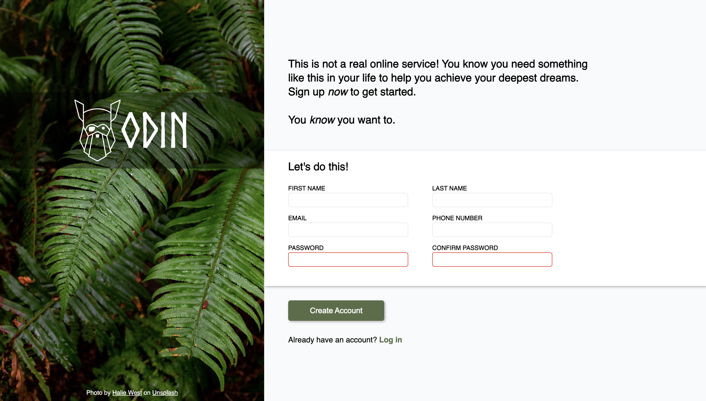

# Sign Up Form
Sign up form project to practice HTML form validation. This project was done as part of The Odin Project's Intermediate HTML & CSS curriculum.

Live Preview: 

## How It's Made
**Tech used:** HTML & CSS

I created the sign up form using HTML and vanilla CSS. The layout was mostly created using flexbox, with the aid of CSS position to iron out some kinks. 

## Lessons Learned
Although I used CSS position minimally, putting it to practice helped my understanding, especially about absolute and relative positions. A quirk I also discovered was that I can't use row gap on divs containing a label and an input, as this will create gaps between the label and input. I worked around this by using padding instead, to put space between each label and input pair.